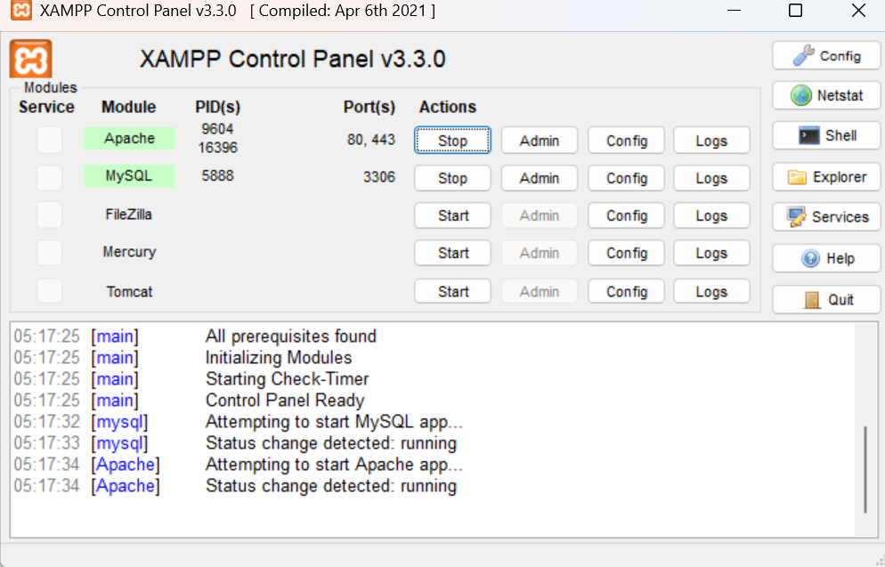
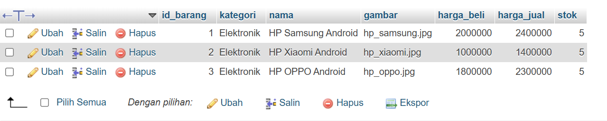
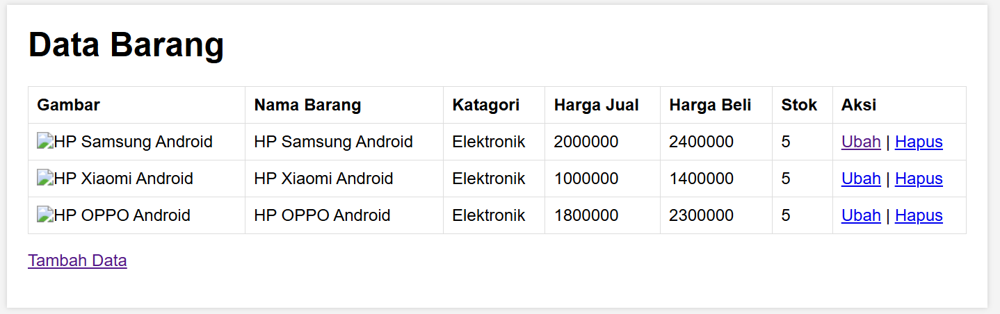
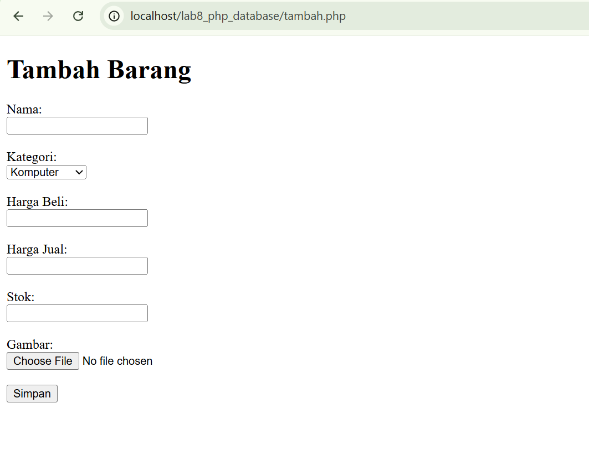
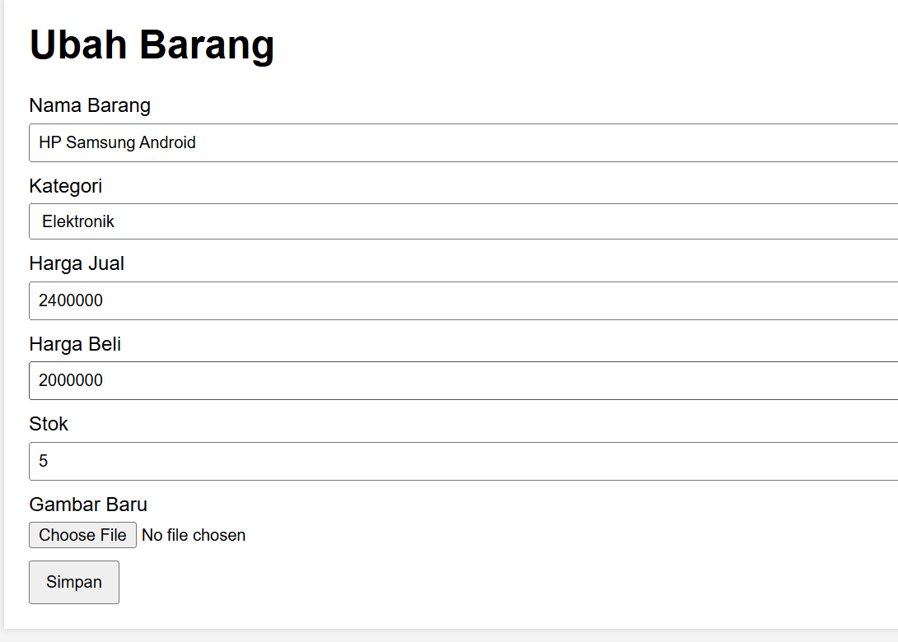

# Identitas Mahasiswa

**Nama :** Razy Al Farisi
**NIM :** 312410445  
**Kelas :** TI.24.A5  


# Laporan Praktikum 8: PHP & MySQL (CRUD)

## 1. Menjalankan XAMPP


## 2. Membuat Database
Buka `http://localhost/phpmyadmin`.

```sql
CREATE DATABASE latihan1;

CREATE TABLE data_barang (
  id_barang int(10) auto_increment Primary Key,
  kategori varchar(30),
  nama varchar(30),
  gambar varchar(100),
  harga_beli decimal(10,0),
  harga_jual decimal(10,0),
  stok int(4)
);
```



## 3. Menghubungkan PHP ke MySQL
File: `koneksi.php`

```php
<?php
$host = "localhost";
$user = "root";
$pass = "";
$db   = "latihan1";

$conn = mysqli_connect($host, $user, $pass, $db);
if (!$conn) {
    die("Koneksi gagal!");
} else {
    echo "Koneksi berhasil";
}
?>
```

## 4. Menampilkan Data (index.php)


## 5. Menambah Data (tambah.php)


## 6. Mengubah Data (ubah.php)


## 7. Menghapus Data (hapus.php)
Proses hapus tidak memiliki halaman tampilan.

